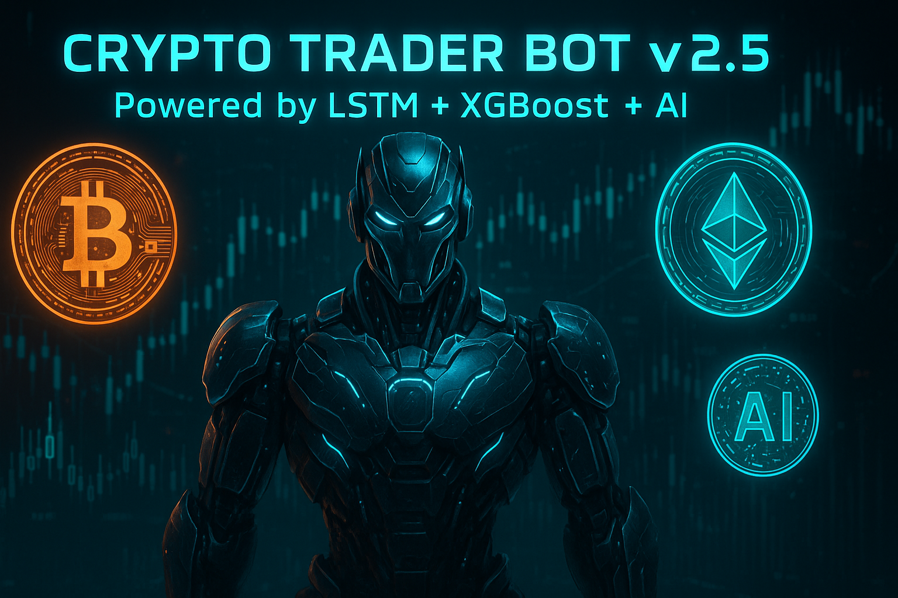

<p align="center">
  
</p>

<p align="center">
  <a href="#"></a>
  <a href="#"></a>
  <a href="#"></a>
  <a href="#"></a>
</p>

---

# 🚀 Crypto Trader Bot v2.5 (Aggressive AI Edition)

_A project by **RekitRex** 🧠💰_

---

## 📚 About This Project

This isn't your average crypto bot.  
**This beast learns. Predicts. Trades aggressively.**

It uses:
- 🧠 **LSTM Neural Networks**
- 🎯 **XGBoost Tree Boosters**
- 📈 **Technical Indicators**
- 🔥 **Adaptive Trading Regimes**

Pre-trained models included. Ready to go.

---

## 🛠️ Setup Instructions

```bash
# Clone Repo
git clone https://github.com/YOUR-GITHUB-USERNAME/crypto_bot_v2.git
cd crypto_bot_v2

# Create Virtual Environment
python3 -m venv .venv
source .venv/bin/activate

# Install Requirements
pip install -r requirements.txt
